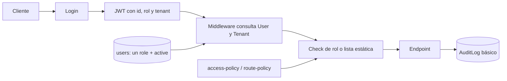
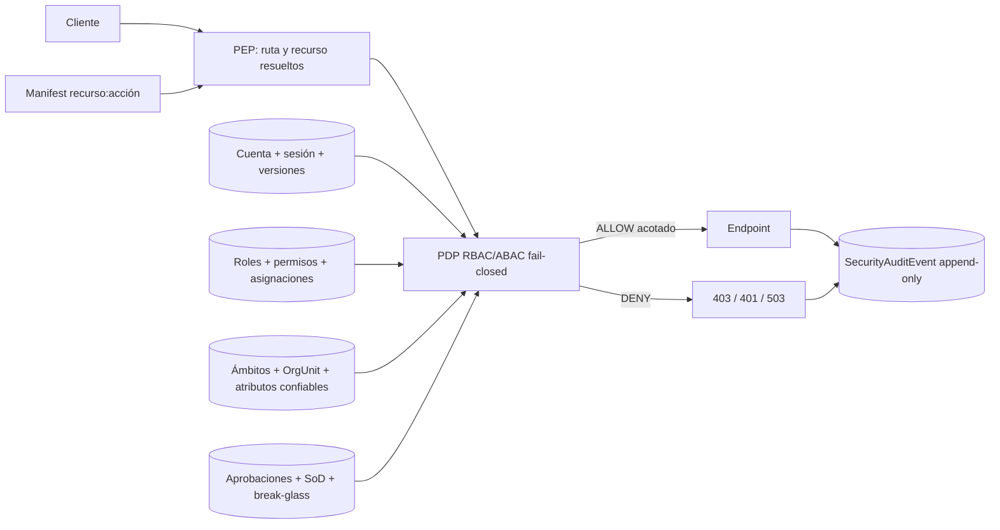
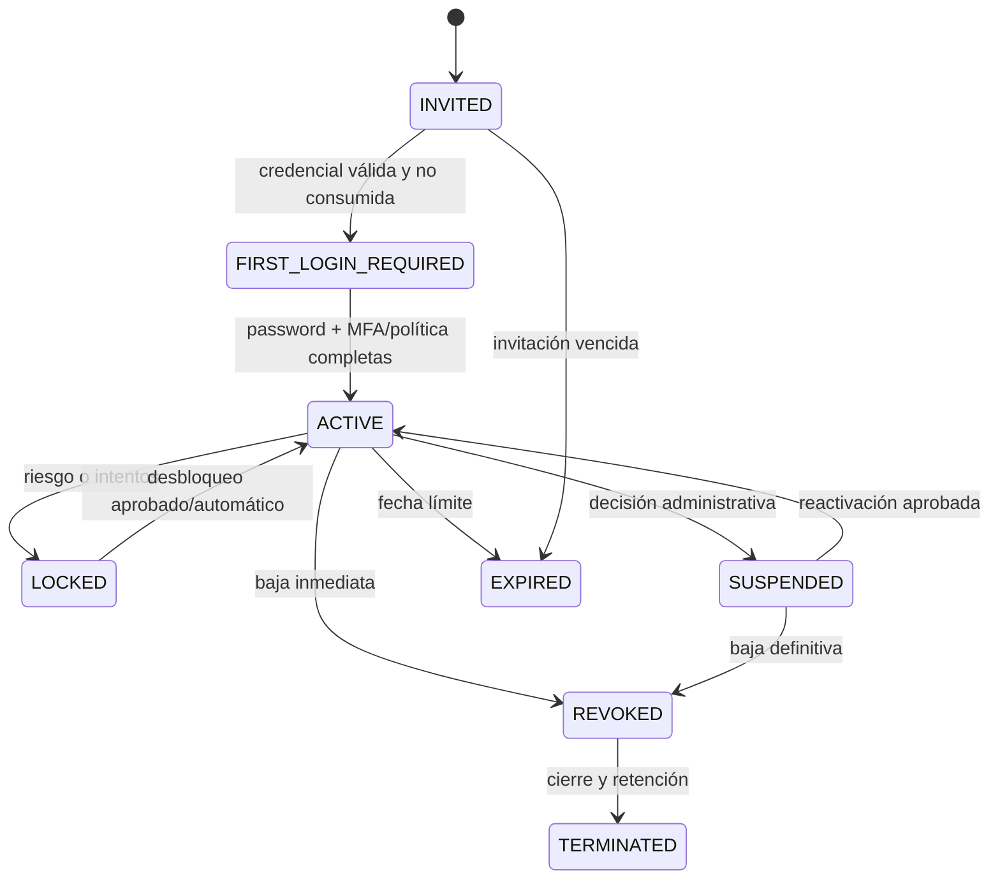

# Modelo de datos RBAC/ABAC enterprise — MuniControl

**Versión del diseño:** 1.1.0

**Fecha de corte:** 9 de agosto de 2026

**Estado:** propuesta técnica; no implementada, no migrada y sin cuentas creadas

**Esquema revisado:** `prisma/schema.prisma` y baseline S14C del mismo change set; base pública previa `e74339c`

**Propuesta Prisma aislada:** [`../prisma/proposals/rbac-abac-v1.prisma`](../prisma/proposals/rbac-abac-v1.prisma)

## 1. Decisión ejecutiva

Recomendamos una capa de autorización aditiva dentro del PostgreSQL autoritativo
de MuniControl, con tres responsabilidades separadas:

- el manifest de rutas define qué combinación exacta `recurso:acción` existe;
- el plano RBAC/ABAC define quién puede ejercerla, sobre qué ámbito, durante qué
  período y con qué condiciones;
- cada endpoint resuelve el recurso real y aplica la decisión en el servidor.

La alternativa recomendada no reemplaza de golpe el control actual. Primero se
materializa sin efectos, después compara decisiones en modo sombra, luego se usa
como intersección restrictiva y recién al final pasa a ser autoritativa. Ninguna
fase puede ampliar permisos de forma silenciosa.

Este diseño es deliberadamente una propuesta. No se debe crear todavía un
usuario por perfil, aplicar una migración ni modificar `User.role`: falta una
atestación institucional de release y resolver la propiedad/alcance del proyecto
Neon observado. S14C ya incorpora una historia Prisma baseline reproducible, pero
el gate que bloquea `prisma migrate deploy` sobre ramas estables sigue siendo
correcto y debe permanecer cerrado con `RELEASE_ATTESTATION_NOT_GOVERNED`.

## 2. Evidencia inspeccionada y diagnóstico

### 2.1 Hechos observados

| Fuente | Hecho observado | Consecuencia actual |
|---|---|---|
| `prisma/schema.prisma` | `User` tiene un único enum `role`, `active` y `passwordHash` | Hay roles gruesos, sin asignaciones múltiples, ámbito, vigencia ni ciclo detallado |
| `prisma/schema.prisma` | `Invitation` guarda `token` directamente y no modela finalidad, intentos ni revocación | No cumple todavía el contrato enterprise de invitación de un solo uso |
| `prisma/schema.prisma` | `AuditLog` es genérico y mutable | Sirve como inventario básico, no como evidencia de seguridad append-only |
| `api/lib/auth.js` y `backend/middleware/authMiddleware.js` | Cada request vuelve a consultar usuario, rol, tenant y estado en DB | Un cambio de rol o desactivación prevalece sobre claims JWT antiguos; es una base valiosa |
| `api/auth/login.js` | Emite JWT de ocho horas y limita intentos en memoria del proceso | No hay sesión revocable, familia de refresh ni rate limit distribuido |
| `backend/routes/auth.js` | `/refresh` responde `410 SESSION_REFRESH_NOT_GOVERNED` | Se mantiene retirado hasta implementar sesión persistida, rotación y detección de reutilización |
| `backend/routes/admin.js` | POST de tenants/usuarios con contraseña responde `410 ACCOUNT_LIFECYCLE_NOT_GOVERNED`; PUT/PATCH de tenant responde `410 TENANT_LIFECYCLE_NOT_GOVERNED` | No existe hoy un alta o lifecycle administrativo habilitado |
| `backend/seed.js` | Gate retirado: siempre falla con código 1, sin secretos ni conexión DB | Evita que automatizaciones antiguas creen identidades fuera del lifecycle gobernado |
| `shared/account-lifecycle.cjs` | Máquina pura, determinista y fail-closed de cuenta/invitación/sesión | Es una fundación testeable; no persiste, autentica ni habilita cuentas |
| `shared/access-policy.cjs` | Roles y capacidades de navegación son exactos y fail-closed | Es una buena frontera de UX; no expresa autorización por recurso o ámbito |
| `shared/route-policy.cjs` | Rutas protegidas, recursos, acciones y permisos exactos están versionados | Es el techo de permisos que el plano de datos debe respetar |
| `scripts/assert-prisma-migrations.mjs` | Valida offline el manifest y la historia sólo con pins exactos; el modo release agrega siempre `RELEASE_ATTESTATION_NOT_GOVERNED` | Separa integridad local de autorización institucional de DDL |
| `prisma/migrations/` | Contiene el baseline aditivo `20260809220336_baseline`, lock y manifest v2 fijados a Prisma `5.22.0` | Existe una historia reproducible en Git; todavía no está autorizada ni marcada en Preview o Production |
| `prisma/schema.prisma` y `shared/prisma-schema-ownership.cjs` | Preservan 13 tablas GRH de Preview con modelos mapeados `@@ignore`: 5 sensibles y 8 de referencia | Prisma Client no expone delegates, pero `@@ignore` no aporta ACL/RLS ni bloquea SQL crudo o credenciales owner |
| `database/migrations/001_initial.sql` y `migrations/*.sql` | Son SQL legacy o materializaciones independientes | No constituyen el baseline del schema Prisma activo |

El manifest fija digest del schema, baseline, migration set, lock y toolchain. Al
implementar RBAC/ABAC habrá que derivar un nuevo `migrationSetId`, fijar el commit
y refrescar el estado de la DB destino; este documento no convierte el baseline
actual en una autorización para agregar las tablas propuestas.

### 2.2 Evidencia conectada S14C y límite estable

El baseline pasó dos replays sobre hijos Neon descartables creados en un LSN de
Preview, sin escribir en Preview ni Production. El hijo A aplicó `migrate deploy`
sobre una DB vacía, obtuvo status/diff cero y materializó las 25 tablas esperadas,
incluidas las 13 ignoradas. El hijo B3 ejecutó únicamente
`migrate resolve --applied 20260809220336_baseline` sobre una copia existente;
status/diff quedaron en cero y el catálogo de negocio permaneció idéntico salvo
`_prisma_migrations`.

La prueba child-at-LSN no es snapshot ni backup/restore gobernado. S14C conserva
un receipt externo saneado, pero no es un receipt gobernado de release ni una
atestación institucional. Además, el proyecto Neon observado conserva
el nombre `puntolimpio-staging-neon`; su propiedad y alcance para MuniControl
Junín son ambiguos. Ambas fronteras mantienen bloqueado todo DDL estable.

En paralelo, el hotfix público `e74339c` sustituyó la ruta que servía el schema
Prisma desde la aplicación por un `404` sin esas definiciones. El deployment pasó
el gate HTTP **12/12**. Es una verificación de superficie, no de RBAC ni DB, y no
reescribe la evidencia histórica **11/11** de `v1.10.0`.

### 2.3 Inferencia estructural

Los controles existentes protegen bien dos límites concretos: una identidad JWT
no autoriza por sí sola y un rol desconocido se deniega. Sin embargo, el permiso
continúa unido a un único `User.role`, y las reglas se reparten entre listas
estáticas y checks de endpoint. Esa estructura no puede representar de forma
consistente “Contaduría sólo en estas unidades”, “Inspector sólo en casos
asignados”, “Empleado sólo sobre sí mismo”, una delegación con vencimiento o una
elevación aprobada por dos personas.

También falta una transición atómica que conecte alta, aprobación, sesión,
revocación y auditoría. Podemos desactivar un usuario, pero no revocar una sola
sesión, detectar reutilización de refresh, invalidar todas las credenciales de un
uso, recertificar accesos ni demostrar una excepción break-glass acotada.

## 3. Invariantes de seguridad

El diseño seleccionado debe hacer verificables estos comportamientos:

1. Toda ruta protegida se resuelve en el manifest; ruta, método, runtime, recurso,
   acción o permiso desconocidos se deniegan.
2. `CapabilityDefinition.key` es exactamente `${resourceType}:${action}` y debe
   existir en `shared/route-policy.cjs`; no hay wildcard, rango ni herencia.
3. Claims del cliente identifican una sesión, pero usuario, tenant, estado,
   versiones, asignaciones, ámbito y recurso se obtienen de fuentes autoritativas.
4. Una asignación municipal nunca cruza de tenant, aunque se adivine un ID válido.
5. Una jerarquía política u organizativa no concede privilegios implícitos.
6. Todo permiso efectivo tiene ámbito y vigencia; ausencia, expiración o atributo
   desconocido equivale a denegación.
7. Un `DENY` explícito aplicable prevalece sobre cualquier `ALLOW`.
8. Cambiar cuenta, contraseña o revocación total incrementa `tokenVersion`;
   cambiar autorización incrementa `authorizationVersion`.
9. Una sesión individual y una familia de refresh pueden revocarse sin esperar
   el vencimiento del JWT.
10. Ningún administrador conoce o entrega una contraseña inicial de otra persona.
11. Una credencial de activación/reset existe sólo como digest HMAC, vence, tiene
    intentos limitados y se consume una sola vez de forma atómica.
12. Solicitante, aprobador y actor incompatible no pueden ser la misma identidad.
13. Una regla SoD preventiva bloquea la activación dentro de la misma transacción.
14. Break-glass nunca crea un rol permanente: exige MFA, aprobación, motivo,
    incidente, capacidades literales, ámbito, sesión y vencimiento.
15. Break-glass no puede superar un tenant, habilitar una ruta desconocida,
    reactivar una cuenta ni ignorar un `DENY` institucional no excepcionable.
16. Toda mutación privilegiada registra evento de seguridad en la misma unidad de
    trabajo; el log no admite UPDATE/DELETE para el rol de aplicación.
17. Auditoría y condiciones no almacenan DNI, CUIL, CBU, email, teléfono ni PII
    cruda de GRH; sólo IDs estables, códigos y metadata permitida.
18. Si DB, política o recurso autoritativo no están disponibles, la respuesta es
    `503` o denegación; nunca se usa una decisión cacheada fuera de vigencia.

## 4. Arquitectura actual y objetivo

### 4.1 Antes



La DB vuelve autoritativa la identidad, pero el control de acceso se agota en un
rol grueso. No hay sesión persistida, ámbito organizativo, asignación temporal,
maker-checker, excepción ni evidencia encadenada.

### 4.2 Después recomendado



El punto de aplicación (PEP) permanece local a cada runtime; el punto de decisión
(PDP) comparte una sola semántica. Antes de llamar al PDP, el endpoint debe
resolver la identidad final del recurso, su tenant, unidad, propietario,
clasificación y estado. Un `resourceId` enviado por el cliente nunca basta.

## 5. Opciones consideradas

### Opción 1 — Endurecer roles estáticos

Conserva `User.role`, el manifest y listas literales, agregando más roles y checks
locales. Es la ruta más corta para pocas superficies y mantiene latencia y
operación conocidas. Lo que da pausa es que cada nuevo perfil multiplica roles
combinatorios y vuelve a dispersar ámbito, vigencia y SoD en los endpoints.

### Opción 2 — Plano RBAC/ABAC aditivo en PostgreSQL

Mantiene PostgreSQL y Prisma como autoridades existentes, agrega el modelo de
esta propuesta y centraliza evaluación sin introducir otro servicio. Permite una
migración por sombra/intersección y transacciones atómicas con cuenta, aprobación
y auditoría. Su costo real es una capa de política que debe diseñarse, probarse y
observarse como componente crítico; también añade lecturas o una caché versionada.

### Opción 3 — IdP y motor de políticas externos

Separa autenticación/federación y decisión de políticas en componentes
especializados. Puede ser preferible con SSO provincial/nacional, muchos
municipios, identidades laborales federadas o equipos operativos dedicados. Hoy
agregaría dependencias, latencia, disponibilidad, sincronización y respuesta a
incidentes antes de tener siquiera un baseline local confiable.

| Dimensión | Opción 1: estática | Opción 2: DB aditiva | Opción 3: externa |
|---|---|---|---|
| Seguridad | Mejora local; persiste deriva y rol combinatorio | Ámbito, vigencia, SoD y lifecycle centralizados | Aislamiento/federación fuertes; riesgo de integración y desincronización |
| Performance | Sin hop nuevo | Una consulta/lectura cacheable y resolución de recurso | Hop de red o sidecar más serialización |
| Memoria | Neutral | Índices y caché acotada por versiones | Clientes, cachés y posiblemente procesos adicionales |
| Confiabilidad | Misma disponibilidad; fallos locales | Misma DB crítica; falla cerrada y transacciones únicas | Nuevo componente crítico y modos de degradación |
| Operación | Baja inicialmente, alta deriva futura | Migraciones, métricas, recertificación y runbooks | SSO, secretos, HA, sincronización y observabilidad adicionales |
| Migración | Fácil, pero no alcanza el objetivo | Aditiva, reversible por flags y sin widening | Compleja; requiere convivencia e identidad federada |

Recomiendo la Opción 2 bajo las restricciones actuales. La Opción 3 se debe
reevaluar cuando exista una necesidad institucional concreta de federación o una
escala que justifique el nuevo límite operativo. La Opción 1 sólo sirve como
techo transitorio y rollback restrictivo, no como arquitectura enterprise final.

## 6. Modelo propuesto

El archivo Prisma es autocontenido y validable, pero usa IDs escalares para no
duplicar `User` y `Tenant`. No se aplica directamente: al seleccionar el diseño,
los modelos se integran al schema activo y la migración SQL agrega relaciones y
controles que Prisma no puede expresar.

### 6.1 Cuenta, sesión y credenciales

| Modelo | Responsabilidad | Controles críticos |
|---|---|---|
| `UserSecurityState` | Lifecycle y versiones de seguridad de `User` | estado explícito, expiración, lock, MFA, `tokenVersion`, `authorizationVersion` |
| `AuthenticationSession` | Sesión y familia de refresh revocables | digest de refresh, rotación, idle/absolute expiry, fuerza de autenticación, revocación individual |
| `OneTimeCredential` | Activación, reset, verificación o enrollment | HMAC digest, pepper fuera de DB, finalidad, vencimiento, intentos, consumo único |

`User.passwordHash` puede permanecer durante la transición. `User.active` se
mantiene por compatibilidad y se actualiza en la misma transacción que
`UserSecurityState`; luego deja de ser la única máquina de estados. Una tarea de
reconciliación debe detectar divergencias, nunca elegir automáticamente el estado
más permisivo.

El token de un solo uso debe contener al menos 256 bits aleatorios. La DB guarda
`HMAC-SHA-256(pepper, token)`, no el token ni un hash rápido sin pepper. El link se
muestra una vez al canal aprobado. El consumo se implementa con un único
`UPDATE ... WHERE status = 'ISSUED' AND expires_at > now() ... RETURNING`, dentro
de la transacción que completa activación/reset.

### 6.2 Catálogo de permisos y política

| Modelo | Responsabilidad | Controles críticos |
|---|---|---|
| `PolicyBundle` | Snapshot inmutable y aprobable de política | namespace, tenant overlay opcional, digest, `routePolicyVersion`, un activo por namespace |
| `CapabilityDefinition` | Catálogo exacto de permisos | `key = resourceType + ':' + action`, sin wildcard |
| `RoleDefinition` | Rol versionado global o municipal | namespace, tenant, bundle, estado, privilegio, aprobación |
| `RoleCapability` | Permisos literales de un rol | sólo claves registradas; `DENY` prevalece; condiciones tipadas |

`shared/route-policy.cjs` sigue siendo el registro de rutas y el techo de
capacidades. El plano de DB no puede inventar `foo:*`, `admin` ni una acción que
el manifest desconozca. `PolicyBundle.routePolicyVersion` impide activar un
bundle diseñado contra otro manifest.

Un overlay municipal puede reducir o acotar el bundle de plataforma. No puede
agregar una ruta/capacidad fuera del catálogo firmado ni superar un `DENY` global.
La activación de un bundle privilegiado usa aprobación dual y bump de
`authorizationVersion` para los sujetos afectados.

### 6.3 Organización, ámbitos y ABAC

| Modelo | Responsabilidad | Controles críticos |
|---|---|---|
| `OrgUnit` | Secretaría, dirección, área, programa o zona | tenant obligatorio, código/path únicos, vigencia |
| `OrgUnitClosure` | Ancestros/descendientes auditables | tenant coherente, depth no negativo, cierre actualizado transaccionalmente |
| `OrgUnitMembership` | Pertenencia/gestión, no privilegio automático | tipo, fuente y vigencia; pertenecer no autoriza por sí solo |
| `AuthorizationScope` | Ámbito tipado de una asignación | selector exclusivo por kind, digest canónico, tenant, constraints versionadas |
| `AttributeDefinition` | Contrato de atributos autorizables | tipo, assurance permitida y namespace |
| `SubjectAttributeValue` | Valor con fuente y vigencia | sólo autoridades confiables; nunca input libre del request |
| `IdentityResourceBinding` | Vincula identidad con su recurso propio | tenant, tipo/ID, autoridad, verificación y vigencia; base de `SELF` |

Semántica mínima de ámbitos:

| `ScopeKind` | Resolución |
|---|---|
| `PLATFORM` | Sólo operaciones de plataforma registradas; `tenantId = NULL` |
| `TENANT` | Todo el tenant, sin selector de unidad/recurso |
| `ORG_UNIT` | La unidad exacta |
| `ORG_SUBTREE` | Unidad y descendientes según closure vigente |
| `SELF` | Recurso resuelto mediante `IdentityResourceBinding`; nunca un ID del cliente |
| `ASSIGNED_RESOURCE` | Caso/expediente asignado por una tabla de negocio autoritativa |
| `RESOURCE` | Tipo e ID exactos dentro del tenant |
| `DATASET` | Dataset declarado, por ejemplo contrato agregado GRH |
| `GEOGRAPHIC_BOUNDARY` | Límite geográfico versionado y resuelto por el servicio de mapas futuro |

`constraints` no es un lenguaje abierto. Cada JSON tiene
`constraintSchemaVersion`, esquema allowlist y operadores limitados. Campos,
operadores o atributos desconocidos deniegan. No se permite código, SQL, regex no
acotada ni JSONPath arbitrario.

### 6.4 Asignaciones

`RoleAssignment` une sujeto, rol versionado y ámbito. Registra fuente, vigencia,
motivo, solicitante, aprobación, suspensión, revocación y reemplazo. Una persona
puede tener varias asignaciones acotadas; no se crean roles combinatorios como
`CONTADOR_SECRETARIA_X_TEMPORAL`.

La activación se ejecuta bajo lock del sujeto:

1. validar cuenta, tenant, bundle, rol, scope y fechas;
2. comprobar aprobación y que el solicitante no aprobó;
3. evaluar SoD contra asignaciones activas y scopes solapados;
4. activar la asignación;
5. incrementar `authorizationVersion`;
6. insertar `SecurityAuditEvent`;
7. confirmar todo en una sola transacción.

Para la transición, el `User.role` vigente se traduce a una asignación con scope
`TENANT` (o `PLATFORM` para `SUPER_ADMIN`) sin borrar ni ampliar nada. Hasta que
la comparación sea verde, el permiso efectivo es la intersección entre la lista
estática actual y el plano nuevo.

### 6.5 Aprobaciones y separación de funciones

| Modelo | Responsabilidad | Controles críticos |
|---|---|---|
| `ApprovalRequest` | Acción y payload inmutables a aprobar | digest, idempotencia, policy version, expiry, receipt |
| `ApprovalStep` | Etapa y capacidad del aprobador | quorum, orden, prohibición de solicitante/actores previos |
| `ApprovalDecision` | Decisión individual | sesión, política, evidencia y razón; única por reviewer/step |
| `SodRule` + `SodRuleTerm` | Pares incompatibles por rol o capacidad | preventiva/detectiva, scope igual/solapado/global |
| `SodConflict` | Evidencia de conflicto | asignaciones involucradas, estado y resolución |
| `SodException` | Excepción explícita y temporal | aprobación, justificación, scope, vencimiento, revocación |

Reglas iniciales obligatorias:

- solicitar rol no permite aprobar el propio rol;
- cargar una fuente no permite aprobar su publicación;
- crear una orden de pago no permite aprobarla ni ejecutarla;
- ejecutar un pago no permite conciliarlo definitivamente;
- solicitar una compra no permite evaluar, adjudicar y pagar en soledad;
- iniciar un restore no permite certificarlo;
- administrar plataforma no concede lectura ambiental de PII municipal.

Estas reglas no se resuelven sólo con roles. El workflow de negocio debe guardar
los IDs de maker, checker, executor y reconciler, y el PDP los compara con el
actor actual. La activación de una asignación usa control preventivo; un job
periódico detecta drift o conflictos heredados y abre `SodConflict`.

### 6.6 Break-glass

`BreakGlassRequest`, `BreakGlassCapability` y `BreakGlassGrant` representan una
elevación de emergencia, no un bypass oculto. El grant:

- referencia un incidente y una justificación no vacía;
- contiene sólo permisos literales del manifest;
- queda limitado a un scope y a una sesión con MFA;
- requiere aprobador distinto del solicitante;
- tiene duración breve y máximo institucional aprobado;
- no se renueva automáticamente;
- se revoca al cerrar el incidente o cambiar `tokenVersion`;
- genera evento por emisión, uso, denegación, revocación y revisión posterior.

No hay “modo dios”. Capacidades destructivas, exportación masiva, cambio de
política, desactivación de auditoría y cruce de tenants permanecen fuera del
break-glass salvo una política institucional específica, versionada y aprobada.

### 6.7 Auditoría y recertificación

`SecurityAuditEvent` usa secuencia, partición, hash previo, hash de evento,
correlación y `signerKeyId`. Esto habilita detección de alteraciones, pero el
modelo por sí solo no garantiza inmutabilidad. La migración debe revocar
`UPDATE/DELETE`, separar el rol escritor, canonicalizar eventos y emitir
checkpoints firmados a un destino de retención independiente.

Mutaciones privilegiadas se auditan en la misma transacción. Metadata sigue una
allowlist y se somete a DLP; no se copian payloads, tokens, hashes de contraseña,
headers ni PII GRH. Lecturas sensibles, denegaciones, break-glass y exportaciones
deben registrar recurso, finalidad, scope, período y resultado.

`AccessReviewCampaign` y `AccessReviewItem` permiten recertificación periódica.
Un ítem vencido o marcado `REVOKE` debe suspender la asignación, incrementar
`authorizationVersion`, revocar sesiones si el riesgo lo requiere y auditar el
resultado.

## 7. Contrato del evaluador

Interfaz conceptual:

```js
authorize({
  permission: 'grh.contract:read',
  routePolicyVersion: '...',
  actor: { userId, tenantId, sessionId, tokenVersion, authorizationVersion },
  resource: { type, id, tenantId, orgUnitId, ownerUserId, datasetKey, attributes },
  context: { now, authenticationStrength, purpose, correlationId }
})
```

Orden obligatorio de evaluación:

1. `resolveProtectedRoute` resuelve runtime, método y path; desconocido deniega.
2. La DB resuelve `User`, `UserSecurityState`, `Tenant` y `AuthenticationSession`.
3. Se comparan status, expiraciones, `tokenVersion` y `authorizationVersion`.
4. El servidor resuelve el recurso final y su tenant; un alias/redirect se
   resuelve antes de autorizar.
5. Se valida permiso exacto, bundle activo y versión del manifest.
6. Se cargan asignaciones activas, permisos del rol y scopes aplicables.
7. Se validan atributos confiables y vigentes; desconocido deniega.
8. Cualquier `DENY` aplicable termina la evaluación.
9. Debe existir al menos un `ALLOW` cuyo scope contenga el recurso.
10. Se aplican SoD, aprobación, MFA, reautenticación y finalidad.
11. Un grant break-glass válido puede sumar sólo su permiso/scope literal, sin
    superar hard-denies.
12. Se registra decisión y recién entonces se ejecuta la operación.

La respuesta interna devuelve `decisionId`, `policyVersion`, assignment/scope
usados y razones codificadas. La respuesta al cliente no revela roles faltantes,
existencia de otros tenants, atributos ni IDs sensibles.

## 8. Lifecycle de cuenta



### Alta normal

1. Un actor con `platform.user:create` o equivalente municipal solicita la cuenta
   sin enviar contraseña.
2. Para roles privilegiados se crea `ApprovalRequest`.
3. Se crea `User` inactivo, `UserSecurityState=INVITED`, asignación pendiente y
   `OneTimeCredential` con digest; no se devuelve el token al solicitante.
4. Un proveedor de notificación aprobado entrega el link al destinatario.
5. Activación, consumo, password hash, MFA, estado y auditoría se confirman en
   transacción; cualquier carrera deja un único ganador.
6. Se emite una sesión corta y revocable. El primer acceso exige cambio o
   enrolamiento que todavía falte.

### Suspensión, baja y recuperación

Una baja atómica cambia lifecycle, incrementa `tokenVersion`, revoca sesiones y
credenciales abiertas, suspende/revoca asignaciones y registra auditoría. No se
borra el usuario porque rompería trazabilidad. La política de retención y eventual
anonimización requiere aprobación legal/institucional.

La recuperación no revela si el correo existe. Emite una nueva credencial,
invalida las anteriores y, al completarse, incrementa `tokenVersion` y revoca la
familia de sesiones previa.

### Gate actual de aprovisionamiento

`backend/seed.js` permanece sólo como gate de retiro. `db:seed` termina con
código `1` y `ACCOUNT_LIFECYCLE_NOT_GOVERNED`, sin leer secretos, importar Prisma
ni conectar a PostgreSQL. No existe una excepción de bootstrap ni se agregan
cuentas para “mostrar cada rol”.

[`ACCOUNT_LIFECYCLE_STATE_MACHINE.md`](ACCOUNT_LIFECYCLE_STATE_MACHINE.md)
documenta la fundación pura que modela transiciones de cuenta, invitación y
sesión. Su presencia no habilita aprovisionamiento: faltan persistencia,
migración, MFA, SoD, auditoría transaccional y E2E conectados.

## 9. Controles SQL que Prisma no expresa

La migración revisada debe incluir, al menos:

1. FKs de todos los `tenantId` a `tenants` y referencias de usuario a `users`.
2. FKs internas para roles, bundles, scopes, approvals, reglas, sesiones y
   campañas, con `ON DELETE RESTRICT` en evidencia/seguridad.
3. Coherencia de tenant en cada relación local mediante FK compuesta o trigger;
   `NULL` sólo para recursos de plataforma explícitos.
4. `CHECK` de rangos: `validUntil > validFrom`, expiraciones futuras al emitir,
   depth no negativo, intentos y quórum positivos.
5. `CHECK` de `CapabilityDefinition.key = resource_type || ':' || action`.
6. `CHECK` por `ScopeKind` para exigir exactamente los selectores permitidos.
7. Índices únicos parciales para una asignación activa equivalente, una membresía
   primaria vigente, un binding propio vigente y un bundle activo por namespace.
8. Unicidad consistente cuando `tenantId IS NULL` mediante índices de expresión;
   `@@unique` de Prisma no alcanza para `NULL` en PostgreSQL.
9. Máquina de estados para credenciales, sesiones, approvals, assignments,
   excepciones y break-glass; transiciones inválidas se rechazan.
10. Consumo atómico de credenciales y rotación de refresh con detección de reuse.
11. Lock por sujeto durante activación/revocación y evaluación SoD preventiva.
12. Prohibición de autoaprobación y de actores previos incompatibles.
13. Revocar `UPDATE`, `DELETE`, `TRUNCATE` sobre `security_audit_events` al rol de
    aplicación; writer mínimo y retención independiente.
14. Canonicalización y encadenado verificables de eventos; checkpoint externo.
15. Trigger o servicio transaccional que incremente `authorizationVersion` ante
    cambios relevantes y `tokenVersion` ante revocación de identidad.

RLS puede agregarse como defensa en profundidad sólo cuando el pool garantice un
contexto tenant transaccional con `SET LOCAL`, cleanup probado y un rol de app sin
`BYPASSRLS`. Habilitar RLS parcialmente sobre conexiones reutilizadas sin ese
contrato sería más peligroso que útil.

## 10. Estrategia de migración

### Fase 0 — Congelar identidad y baseline

- conservar el baseline S14C, schema digest y toolchain exactos ya versionados;
- inventariar tablas, constraints, enums, extensiones, `_prisma_migrations` y
  drift de la rama estable sin modificarla;
- resolver documentalmente propietario, municipio, target y ventana del proyecto
  Neon hoy denominado `puntolimpio-staging-neon`;
- obtener backup/restore gobernado y atestación CI/KMS/OIDC con doble revisión
  DBA/ingeniería antes de marcar el baseline en una rama estable;
- mantener bloqueados `db push`, `migrate reset` y migraciones ad hoc.

**Gate:** el manifest y `db:baseline:status` pueden pasar offline con pins exactos;
eso no habilita DDL. `db:migrate:status` debe explicar la historia estable sin
drift y el modo release debe seguir fallando con
`RELEASE_ATTESTATION_NOT_GOVERNED` hasta implementar la atestación institucional.

### Fase 1 — Tablas aditivas inertes

- integrar los modelos seleccionados al schema activo;
- generar una migración SQL offline y agregar manualmente todos los controles de
  la sección anterior;
- aplicar sobre una copia efímera representativa y ejecutar migración dos veces
  para verificar el comportamiento esperado;
- crear catálogo/bundle inicial de política, pero ninguna cuenta ni asignación
  nueva;
- mantener runtime sin leer estas tablas.

**Gate:** schema, SQL, FKs, checks, índices, permisos DB, backup y restore pasan
revisión. La propuesta `.prisma` nunca se aplica directamente.

### Fase 2 — Backfill y modo sombra

- crear `UserSecurityState` para cada usuario sin cambiar su acceso;
- traducir roles actuales a `RoleDefinition` y `RoleAssignment` equivalentes;
- importar las permissions exactas de `shared/route-policy.cjs` y fijar
  `ROUTE_POLICY_VERSION` en el bundle;
- ejecutar PDP en sombra y comparar `legacyDecision` contra `proposedDecision`;
- clasificar cada divergencia: bug, política pendiente o dato incompleto.

**Gate:** cero `proposed=ALLOW` cuando `legacy=DENY`; todas las divergencias
restrictivas tienen decisión institucional documentada.

### Fase 3 — Sesiones y lifecycle

- introducir sesiones persistidas, refresh rotativo y versiones;
- retirar alta con contraseña elegida por administrador;
- implementar invitación, activación, reset, suspensión y baja transaccionales;
- invalidar las `Invitation.token` legacy en vez de migrarlas como credenciales
  válidas;
- forzar reingreso controlado para crear sesiones v1.

**Gate:** carreras, reuse, revocación y recuperación pasan pruebas; no existe
token/contraseña en logs, respuestas, DB de invitaciones o documentación.

### Fase 4 — Intersección restrictiva

- `effective = staticAllow AND databaseAllow`; cualquier deny gana;
- habilitar por permission/ruta, primero lectura agregada GRH y después mutaciones;
- observar latencia, errores, decisiones y soporte por tenant;
- mantener rollback a intersección, nunca a una modalidad más permisiva.

**Gate:** smokes permitidos/denegados, cross-tenant, scopes y fallback 503 pasan
en preview con datos sintéticos y snapshot GRH privado autorizado.

### Fase 5 — DB autoritativa y recertificación

- dejar el manifest como registro de rutas/permisos y mover asignaciones al plano
  DB;
- activar approvals, SoD, break-glass y campañas de revisión;
- retirar uso autorizador de `User.role` y mantenerlo temporalmente sólo para
  compatibilidad observable;
- removerlo en una migración posterior, nunca en el mismo corte.

**Gate:** primera recertificación completada, runbooks ensayados, auditoría
verificada y aprobación de release institucional.

## 11. Pruebas y gates de aceptación

### 11.1 Datamodel y migración

- `prisma format` y `prisma validate` del schema activo y de la propuesta;
- `migrate diff` revisado, sin DROP/ALTER destructivo inesperado;
- baseline reproducible desde cero y compatible con DB existente;
- FKs cross-tenant negativas, checks, índices parciales y roles DB probados;
- forward-fix y restore ensayados con tiempos registrados.

### 11.2 Autorización

- permiso/ruta/recurso/acción desconocidos: deny;
- rol/capability sin wildcard ni herencia;
- tenant ajeno, aun con ID válido: deny sin filtrar existencia;
- `SELF` sobre otra persona: deny;
- binding de identidad ausente, revocado, ambiguo o de baja assurance: deny;
- `ORG_UNIT` y `ORG_SUBTREE` exactos ante reparenting;
- recurso asignado a otra identidad: deny;
- assignment/scope/atributo vencidos: deny;
- atributo sin assurance o schema desconocido: deny;
- `DENY` y overlay global prevalecen;
- DB/PDP no disponible: 503, sin fallback permisivo;
- cambio de `authorizationVersion`: caché invalidada o deny/reload.

### 11.3 Cuenta y sesión

- cuenta suspendida/revocada/expirada: 401 inmediato;
- token con `tokenVersion` viejo: 401;
- sesión revocada: 401 aunque el access token no venció;
- refresh rotado reutilizado: revoca familia y audita;
- dos consumos concurrentes del mismo link: exactamente uno tiene éxito;
- link vencido, propósito incorrecto o intentos agotados: deny;
- reset no revela existencia de email;
- secretos, token y password nunca aparecen en logs ni responses.

### 11.4 Approvals, SoD y break-glass

- solicitante no aprueba su propia acción;
- maker no actúa como checker/executor/reconciler incompatible;
- asignación conflictiva preventiva no se activa bajo carrera concurrente;
- excepción vencida/revocada no habilita;
- break-glass exige MFA, approval, incidente, scope y sesión;
- break-glass vencido se deniega y no renueva;
- hard-deny, tenant y ruta desconocida siguen denegados;
- revisión posterior queda pendiente hasta un actor independiente.

### 11.5 Auditoría y privacidad

- toda mutación privilegiada tiene un evento correlacionado y atómico;
- rol de app no puede editar, borrar ni truncar eventos;
- verificador detecta alteración, hueco, reorder o hash previo incorrecto;
- metadata DLP rechaza PII, credenciales, tokens y payloads crudos;
- un auditor sólo lectura no puede ejecutar la acción auditada.

### 11.6 Performance y confiabilidad

No se suministró un presupuesto de latencia/memoria, por lo que no se inventa un
porcentaje. Antes del canary se registra p50/p95/p99, queries por request, cache
hit, locks, tamaño de índices, error rate y saturación para el flujo vigente. El
umbral de aceptación se aprueba antes de medir el candidato. También se prueban
DB lenta/caída, cache fría, policy mismatch, clock skew, refresh race y rollback.

## 12. Rollout y rollback

Flags propuestos, todos server-side y auditados:

| Modo | Semántica |
|---|---|
| `legacy` | Sólo política vigente; no habilita ninguna capacidad nueva |
| `shadow` | Vigente decide; PDP nuevo compara y no concede |
| `intersect` | Deben permitir vigente y PDP nuevo |
| `database` | Manifest registra; PDP DB decide; unknown/error falla cerrado |

El rollback de aplicación retrocede `database -> intersect -> shadow` según la
fase, sin borrar tablas ni historia. No se revierte a `legacy` si ya existen
asignaciones que dependen de scope/SoD. Las migraciones son aditivas; un problema
se corrige con forward-fix o restore aprobado, no con DROP urgente.

Kill switches separados revocan: una sesión, familia refresh, usuario, tenant,
bundle, assignment o todo break-glass. Cada uno incrementa la versión adecuada y
deja evidencia.

## 13. Decisiones pendientes antes de implementar

1. Autoridad institucional que aprueba roles, excepciones y bundles por tenant.
2. Matriz de capabilities completa para Intendencia, Secretaría, Contaduría,
   Tesorería, Compras, RRHH, Inspector, Auditor, Empleado, Tecnología y Plataforma.
3. Clasificación de datos y finalidades permitidas, especialmente PII GRH.
4. Duración máxima de sesiones, asignaciones temporales, demo y break-glass.
5. MFA mínimo para roles privilegiados y proveedor de identidad futuro.
6. Política de retención, anonimización y exportación de auditoría.
7. SLO de autorización y disponibilidad del plano de identidad.
8. Alcance de RLS y contrato seguro del pool PostgreSQL.
9. Canal aprobado para invitaciones/reset y protección antiabuso distribuida.
10. Responsable de recertificación y periodicidad por riesgo.

## 14. No objetivos de v1

- crear usuarios o contraseñas de demostración;
- fusionar GRH con la DB de personas de ejemplo;
- almacenar PII GRH en tablas de autorización;
- implementar SSO/OIDC/SAML sin una autoridad institucional seleccionada;
- representar service accounts como usuarios humanos;
- dar acceso por cargo político, nombre de pantalla o visibilidad de menú;
- habilitar RLS, PostGIS o un motor externo sin pruebas operativas;
- sustituir la aprobación humana con una decisión de IA.

## 15. Handoff de implementación

Orden recomendado de paquetes revisables:

- **WP0 — Baseline y drift:** baseline Prisma y replay descartable A/B3 ya
  reproducibles; siguen pendientes identidad institucional del target, evidencia
  de DB estable, backup/restore gobernado, preflight y atestación CI/KMS/OIDC. El
  child-at-LSN y el receipt estructural no autorizan DDL.
- **WP1 — Catálogo:** bundle, capabilities exactas, roles y scopes inertes.
- **WP2 — Organización:** OrgUnit, closure, memberships y atributos confiables.
- **WP3 — Asignaciones:** lifecycle, approvals y SoD preventivo.
- **WP4 — Sesiones:** token/authz versions, refresh rotation y revocación.
- **WP5 — Invitaciones:** alta sin contraseña, activation/reset de un uso.
- **WP6 — PDP/PEP:** manifest, resolución de recurso, shadow e intersección.
- **WP7 — Break-glass y auditoría:** elevación acotada, cadena y checkpoint.
- **WP8 — Recertificación:** campañas, runbooks, métricas y canary.

Cada WP necesita threat model focal, migración/rollback, tests permitidos y
denegados, DLP, observabilidad y aceptación independiente. Sólo después de WP8 y
un preview aislado se pueden aprovisionar cuentas temporales por perfil.

## 16. Evidencia de validación de esta propuesta

El archivo aislado fue formateado y validado localmente con Prisma 5.22 sin
conectarse a una DB. Por separado, el baseline core S14C pasó replay en los hijos
descartables A/B3; ese replay no incluyó la propuesta RBAC/ABAC. Por lo tanto, la
validación de esta propuesta sólo demuestra sintaxis del datamodel: no demuestra
FKs hacia el schema activo, SQL de hardening, migración RBAC/ABAC, seguridad
runtime, DB estable ni despliegue.

Comandos de revisión seguros:

```powershell
npx.cmd prisma format --schema prisma/proposals/rbac-abac-v1.prisma
npx.cmd prisma validate --schema prisma/proposals/rbac-abac-v1.prisma
git diff --check -- docs/RBAC_ABAC_DATA_MODEL.md prisma/proposals/rbac-abac-v1.prisma
```

No ejecutar `db push`, `migrate dev`, `migrate reset` ni `migrate deploy` sobre
esta propuesta.
